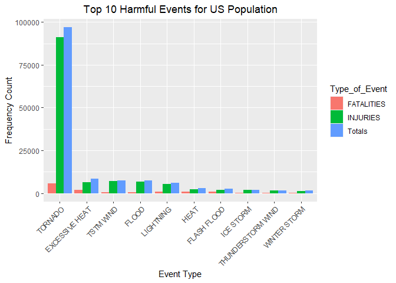
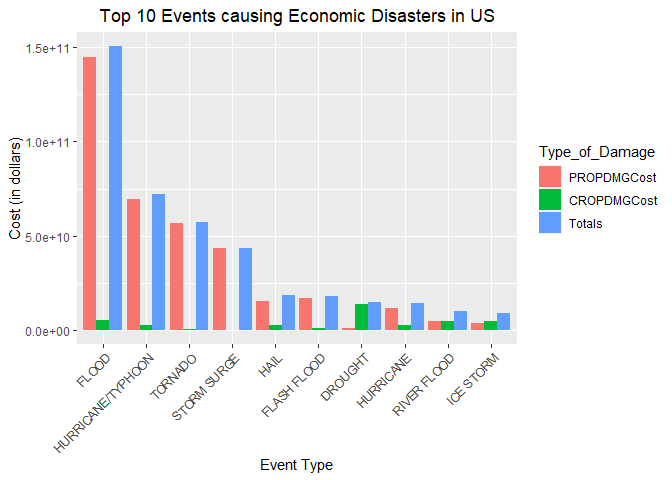

# Analysis of the Harmful Effects of Storms to the Health and Economy of the US Population


## 1: Synopsis
This is a report of exploring the U.S. National Oceanic and Atmospheric Administration’s (NOAA) storm database and analysis corresponding to most disaster storm event impacts in United States on public health and economic consequences. The database tracks the characteristics of major storms and weather events in the United States. The data was collected during the period from 1950 through 2011. In specific there are two questions that have been tried to answer through this analysis:

Across the United States, which type of events are most harmful with respect to population health?
Across the United States, which type of events have the greatest economic consequences?
After the analysis of storm data events it was found that Tornado causes the most public health impact, while Flood causes the most economic impact in relation to crop and property damage.
  
## 2: Loading and Processing the Raw Data
The [Storm Events Database](http://www.ncdc.noaa.gov/stormevents/ftp.jsp) on which the analysis is performed, provided by [National Climatic Data Center](http://www.ncdc.noaa.gov/). The compressed data can be downloaded from the [source URL](https://d396qusza40orc.cloudfront.net/repdata%2Fdata%2FStormData.csv.bz2). Furthermore the documentation details of the data can be found [here](https://d396qusza40orc.cloudfront.net/repdata%2Fpeer2_doc%2Fpd01016005curr.pdf).

### 2.1: Downloading the raw data file into the current folder

```r
file_url <- "https://d396qusza40orc.cloudfront.net/repdata%2Fdata%2FStormData.csv.bz2"
download.file(file_url, destfile = "storm_data.csv.bz2", method = "curl")
```

### 2.2: Extracting the data into a dataframe. Then converting it into a data.table

```r
library(data.table)
library(dplyr)
```

```r
library(ggplot2)

dataset <- read.csv("storm_data.csv.bz2")
# Converting data.frame to data.table
dataset <- as.data.table(dataset)
```

### 2.3: Examining the dataset and preparing it for analysis

```r
# Reading all the variable names in the dataset
names(dataset)
```

```
##  [1] "STATE__"    "BGN_DATE"   "BGN_TIME"   "TIME_ZONE"  "COUNTY"    
##  [6] "COUNTYNAME" "STATE"      "EVTYPE"     "BGN_RANGE"  "BGN_AZI"   
## [11] "BGN_LOCATI" "END_DATE"   "END_TIME"   "COUNTY_END" "COUNTYENDN"
## [16] "END_RANGE"  "END_AZI"    "END_LOCATI" "LENGTH"     "WIDTH"     
## [21] "F"          "MAG"        "FATALITIES" "INJURIES"   "PROPDMG"   
## [26] "PROPDMGEXP" "CROPDMG"    "CROPDMGEXP" "WFO"        "STATEOFFIC"
## [31] "ZONENAMES"  "LATITUDE"   "LONGITUDE"  "LATITUDE_E" "LONGITUDE_"
## [36] "REMARKS"    "REFNUM"
```

```r
# Subsetting the variables we will need for our analysis:
dataset <- subset(x = dataset,
                  subset = (EVTYPE != "?" & 
                            (INJURIES > 0 | FATALITIES > 0 | PROPDMG > 0 | CROPDMG > 0)),
                  select = c(EVTYPE, FATALITIES, INJURIES, PROPDMG, PROPDMGEXP, CROPDMG, CROPDMGEXP))
```


### 2.4: Converting the data values into their numeric forms

```r
# Converting the PROPDMGEXP and CROPDMGEXP values into numeric values for calculations:
# Inspecting the levels of PROPDMGEXP and CROPDMGEXP
levels(dataset$PROPDMGEXP)
```

```
##  [1] ""  "-" "?" "+" "0" "1" "2" "3" "4" "5" "6" "7" "8" "B" "h" "H" "K" "m" "M"
```

```r
levels(dataset$CROPDMGEXP)
```

```
## [1] ""  "?" "0" "2" "B" "k" "K" "m" "M"
```

```r
# Create a lookup table with the numeric values corresponding to each level of PROPDMGEXP and CROPDMGEXP
prop_lookup <- data.table(PROPDMGEXP = levels(dataset$PROPDMGEXP), 
                          PROPDMGEXPNum = c(10^0, 10^0, 10^0, 10^0, 10^0, 10^1, 10^2, 
                                            10^3, 10^4, 10^5, 10^6, 10^7, 10^8, 10^9, 
                                            10^2, 10^2, 10^3, 10^6, 10^6))

crop_lookup <- data.table(CROPDMGEXP = levels(dataset$CROPDMGEXP), 
                          CROPDMGEXPNum = c(10^0, 10^0, 10^0, 10^2, 10^9, 10^3, 10^3, 
                                            10^6, 10^6) )

# Merging the two lookup values into the dataset
dataset <- merge.data.table(dataset, prop_lookup, by = "PROPDMGEXP")
dataset <- merge.data.table(dataset, crop_lookup, by = "CROPDMGEXP")
remove(crop_lookup, prop_lookup)


# Calculating the Property Damage Cost and Crop Damage Cost in their respective numeric values:
dataset <- mutate(dataset, PROPDMGCost = PROPDMG * PROPDMGEXPNum, CROPDMGCost = CROPDMG * CROPDMGEXPNum)

# Dropping the unnecessary columns from the dataset
dataset <- select(dataset, -PROPDMG, -PROPDMGEXP, -PROPDMGEXPNum, -CROPDMG, -CROPDMGEXP, -CROPDMGEXPNum)
dataset <- as.data.table(dataset)
```


### 2.5: Calculating the total damage, fatalities and injuries happened

```r
total_damage <- dataset[, .(PROPDMGCost = sum(PROPDMGCost), CROPDMGCost = sum(CROPDMGCost), Totals = sum(PROPDMGCost) + sum(CROPDMGCost)), by = .(EVTYPE)]
total_damage <- total_damage[order(-Totals)]
total_damage <- total_damage[1:10, ]
head(total_damage, 10)
```

```
##                EVTYPE  PROPDMGCost CROPDMGCost       Totals
##  1:             FLOOD 144657709807  5661968450 150319678257
##  2: HURRICANE/TYPHOON  69305840000  2607872800  71913712800
##  3:           TORNADO  56947380677   414953270  57362333947
##  4:       STORM SURGE  43323536000        5000  43323541000
##  5:              HAIL  15735267513  3025954473  18761221986
##  6:       FLASH FLOOD  16822673979  1421317100  18243991079
##  7:           DROUGHT   1046106000 13972566000  15018672000
##  8:         HURRICANE  11868319010  2741910000  14610229010
##  9:       RIVER FLOOD   5118945500  5029459000  10148404500
## 10:         ICE STORM   3944927860  5022113500   8967041360
```

```r
# Calcuating Total Fatalities and Injuries
total_injuries <- dataset[, .(FATALITIES = sum(FATALITIES), INJURIES = sum(INJURIES), Totals = sum(FATALITIES) + sum(INJURIES)), by = .(EVTYPE)]
total_injuries <- total_injuries[order(-Totals)]
total_injuries <- total_injuries[1:10, ]
head(total_injuries, 10)
```

```
##                EVTYPE FATALITIES INJURIES Totals
##  1:           TORNADO       5633    91346  96979
##  2:    EXCESSIVE HEAT       1903     6525   8428
##  3:         TSTM WIND        504     6957   7461
##  4:             FLOOD        470     6789   7259
##  5:         LIGHTNING        816     5230   6046
##  6:              HEAT        937     2100   3037
##  7:       FLASH FLOOD        978     1777   2755
##  8:         ICE STORM         89     1975   2064
##  9: THUNDERSTORM WIND        133     1488   1621
## 10:      WINTER STORM        206     1321   1527
```


## 3: Results


### 3.1: Events that are Most Harmful to Population Health

```r
# Melting the total_injuries data.table to put it easily in the bar graph
Harmful_Events <- melt(total_injuries, id.vars="EVTYPE", variable.name = "Type_of_Event")

# Creating the barplot
ggplot(Harmful_Events, aes(x=reorder(EVTYPE, -value), y=value)) + 
    geom_bar(stat="identity", aes(fill=Type_of_Event), position="dodge") + 
    ylab("Frequency Count") +
    xlab("Event Type") + 
    theme(axis.text.x = element_text(angle=45, hjust=1)) +
    ggtitle("Top 10 Harmful Events for US Population") + 
    theme(plot.title = element_text(hjust = 0.5))
```

<!-- -->
  
> According to the analysis, **Tornado** is the natural disaster which causes most harm to the US population. It is the most fatalities and injuries causing event.


### 3.2: Events that have the Greatest Economic Consequences

```r
# Melting the total_damage data.table to put it easily in the bar graph 
Economic_Consequences <- melt(total_damage, id.vars="EVTYPE", variable.name = "Type_of_Damage")

# Creating the barplot
ggplot(Economic_Consequences, aes(x=reorder(EVTYPE, -value), y=value)) +
    geom_bar(stat="identity", aes(fill=Type_of_Damage), position="dodge") +
    ylab("Cost (in dollars)") +
    xlab("Event Type") + 
    theme(axis.text.x = element_text(angle=45, hjust=1)) +
    ggtitle("Top 10 Events causing Economic Disasters in US") +
    theme(plot.title = element_text(hjust = 0.5))
```

<!-- -->
  
> From the graph, we can say **Flood** is the most harmful event which causes the most economic disaster in the US. Here, **Property damages** are higher than **Crop damages**.

